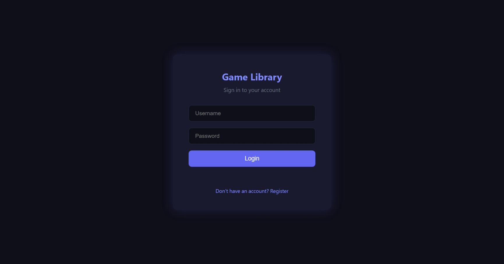
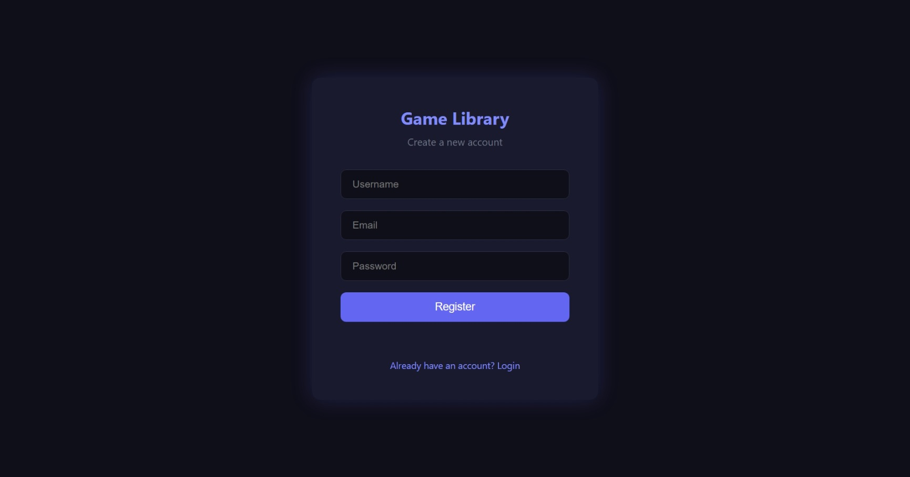
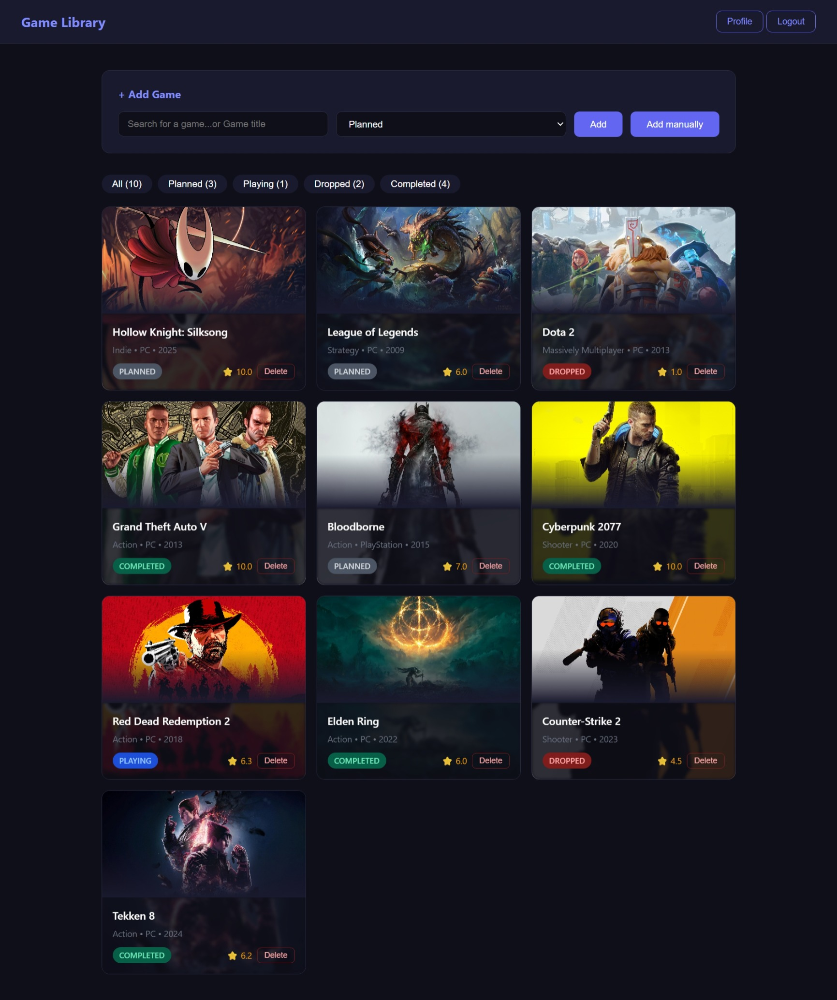
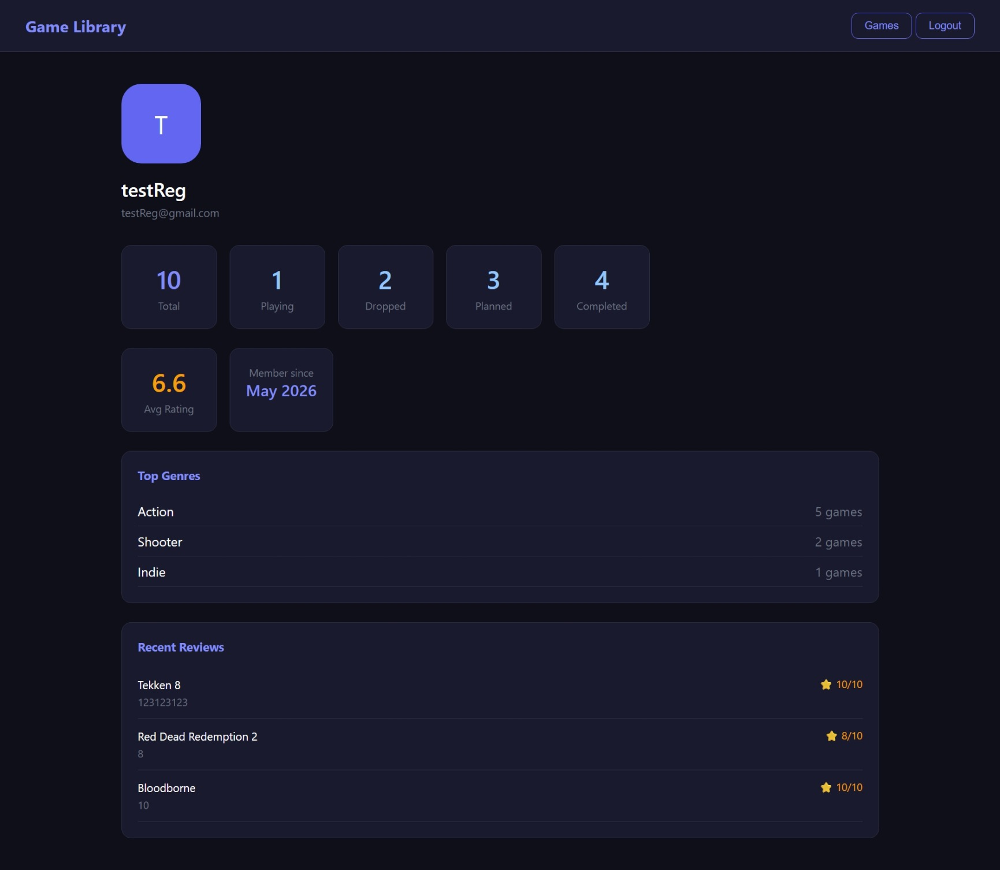

# 🎮 Game Library

A full-stack web application for tracking your personal game collection. Built with Java Spring Boot and vanilla JavaScript.

## Screenshots

### Login & Register



### Game Library


### Profile


## Features

- 🔐 JWT Authentication (register/login)
- 🎮 Search games via RAWG API (900k+ games)
- 📚 Track games with statuses: Planned, Playing, Completed, Dropped
- ⭐ Leave reviews with 1-10 star ratings
- 📊 Profile with statistics, top genres, recent reviews
- 🖼️ Game covers from RAWG API
- 🔍 Filter games by status with counters

## Tech Stack

**Backend**
- Java 21
- Spring Boot 3.5
- Spring Security + JWT
- PostgreSQL
- Spring Data JPA / Hibernate
- Swagger / OpenAPI

**Frontend**
- HTML / CSS / JavaScript
- RAWG API integration

**Testing**
- JUnit 5
- Mockito

## Getting Started

### Prerequisites
- Java 21+
- PostgreSQL
- Maven

### Setup

1. Clone the repository
```bash
git clone https://github.com/Nektoreal/game-library.git
cd game-library
```

2. Create PostgreSQL database
```sql
CREATE DATABASE gamelibrary;
```

3. Update `backend/src/main/resources/application.properties`
```properties
spring.datasource.url=jdbc:postgresql://localhost:5432/gamelibrary
spring.datasource.username=postgres
spring.datasource.password=YOUR_PASSWORD
```

4. Run the backend
```bash
cd backend
./mvnw spring-boot:run
```

5. Open `frontend/index.html` with Live Server (VS Code extension)

## API Documentation

Swagger UI available at: `http://localhost:8080/swagger-ui.html`

## Running Tests

```bash
cd backend
./mvnw test
```

## Project Structure

```text
game-library/
├── backend/
│   └── src/
│       ├── main/java/com/gamelibrary/
│       │   ├── config/
│       │   ├── controller/
│       │   ├── entity/
│       │   ├── repository/
│       │   ├── security/
│       │   └── service/
│       └── test/
└── frontend/
    ├── css/
    ├── js/
    ├── index.html
    ├── games.html
    └── profile.html
```